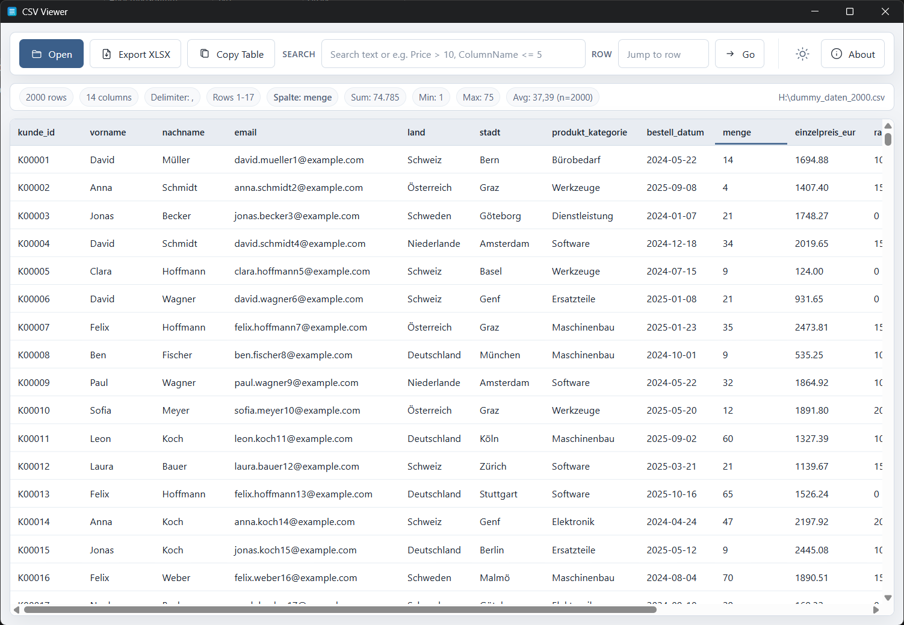
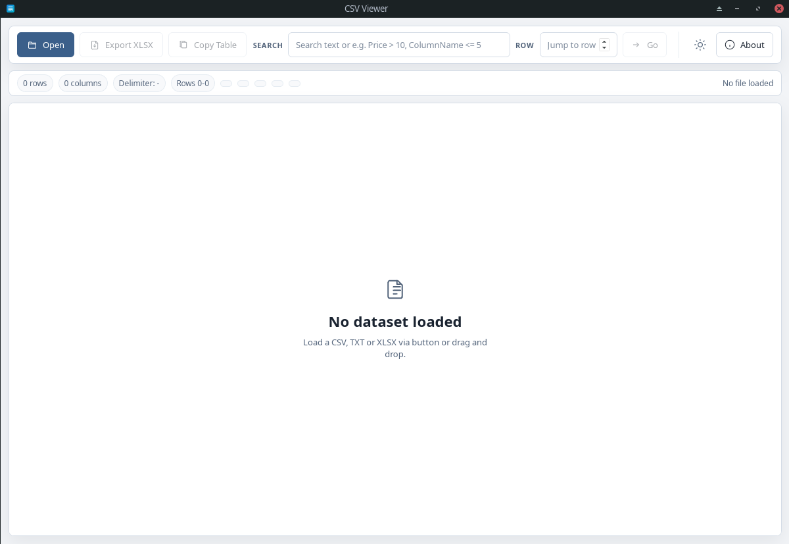
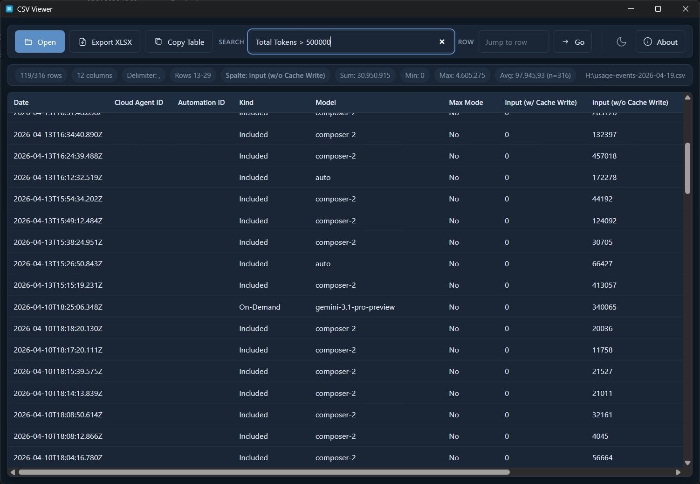

# CSV Viewer

**A fast, local desktop app to open large CSV/TXT files, search and filter, and export to Excel — built with Tauri v2.**

[](https://opensource.org/licenses/Apache-2.0)
[](https://github.com/fly2nbc-oss/CSV_Viewer/releases/latest)
[](https://github.com/fly2nbc-oss/CSV_Viewer/actions/workflows/ci.yml)


---

## Table of contents

- [Screenshots](#screenshots)
- [Features](#features)
- [Quick start / Installation](#quick-start--installation)
- [Usage](#usage)
- [Supported platforms & formats](#supported-platforms--formats)
- [Development & build](#development--build)
- [Roadmap, known issues & contributing](#roadmap-known-issues--contributing)
- [License](#license)

---

## Screenshots

<p align="center">
  
</p>

<p align="center">
  
</p>

<p align="center">
  
</p>

---

## Features

- **Open files** — CSV, TXT, and XLSX via dialog or **drag & drop**.
- **Delimiter detection** — Common delimiters (comma, semicolon, tab, etc.) are detected when reading in the backend.
- **Large datasets** — **Virtualized** table; only visible rows are rendered in the DOM.
- **Search & filter** — Full-text across all columns; **numeric filters** with column names and operators (`>`, `<`, `>=`, `<=`, `=`).
- **Column header** — **Single-click** shows **sum, min, max, average**, and sample count **n** for numeric columns (based on **currently filtered** rows). **Double-click** inserts the column name into the search field.
- **Navigation** — Jump to a row by number.
- **Export** — Save the current view as **Excel (.xlsx)**.
- **Clipboard** — Copy the table for pasting elsewhere.
- **Appearance** — **Light and dark** themes; in-app **About** dialog.
- **Status bar** — Row/column counts, visible row range, delimiter, file path.

---

## Quick start / Installation

Download installers and bundles from **[Releases](https://github.com/fly2nbc-oss/CSV_Viewer/releases)** (look for version tags `v*`).

| Platform | Typical assets |
| -------- | -------------- |
| **Windows** | NSIS setup (`.exe`), MSI (`.msi`), portable `csv-viewer.exe` |
| **Linux** | `.deb`, AppImage, portable `csv-viewer` |
| **macOS** | `.dmg` |

Linux `.deb` example:

```bash
sudo apt install ./CSV\ Viewer_*_amd64.deb
```

See [Tauri Linux prerequisites](https://v2.tauri.app/start/prerequisites/) for system libraries (e.g. WebKit-GTK).

---

## Usage

1. **Open** a file with **Open** or drop it on the window.
2. **Search** with plain text or numeric expressions (e.g. `Price > 10` or `ColumnName <= 5`).
3. **Jump** to a row using the row field and **Go**.
4. **Export XLSX** or **Copy Table** when you need the data elsewhere.
5. Use **About** for version and repository link.

---

## Supported formats

| Category | Details |
| -------- | ------- |
| **Import** | CSV, TXT (auto delimiter), XLSX (sheet selector when applicable) |
| **Export** | XLSX (Excel-compatible) |

---

## Development & build

**Requirements:** Node.js (LTS recommended), **Rust (stable)**, and [Tauri prerequisites](https://v2.tauri.app/start/prerequisites/) for your OS.

```bash
git clone https://github.com/fly2nbc-oss/CSV_Viewer.git
cd CSV_Viewer
npm install
npm run tauri dev    # development
npm run tauri build  # production bundles
```

For a reliable **Linux `.deb`** only:

```bash
npm run tauri build -- --bundles deb
```

**Release builds:** Pushing a tag `v*` runs [`.github/workflows/release.yml`](.github/workflows/release.yml) (`tauri-apps/tauri-action`). Release assets include platform bundles; GitHub also attaches source archives. Use **Release** assets for direct downloads (not CI ZIP artifacts).

**Binary size:** [`src-tauri/Cargo.toml`](src-tauri/Cargo.toml) release profile uses `opt-level = "z"`, LTO, strip, and `panic = "abort"`; most of the installed size is still the WebView runtime.

### Project layout

- **`web/`** — Static HTML, CSS, JavaScript frontend (loaded as `frontendDist`).
- **`src-tauri/`** — Rust backend, Tauri config, icons (`read_csv`, `read_xlsx`, `export_xlsx`, drag-and-drop).
- **`packaging/manjaro/`** — Local **pacman** packaging helpers.

More detail: [`CSV_Viewer_Doc.md`](CSV_Viewer_Doc.md).

---

## Roadmap, known issues & contributing

- **Roadmap** — Driven by [Issues](https://github.com/fly2nbc-oss/CSV_Viewer/issues); suggestions welcome.
- **Known issues** — AppImage builds can fail if the Linux AppImage toolchain is missing or misconfigured; use `--bundles deb` as a fallback.
- **Contributing** — See [CONTRIBUTING.md](CONTRIBUTING.md) and [CODE_OF_CONDUCT.md](CODE_OF_CONDUCT.md).

---

## License

Licensed under the **Apache License, Version 2.0**. See [LICENSE](LICENSE).

---

**Repository:** <https://github.com/fly2nbc-oss/CSV_Viewer>
